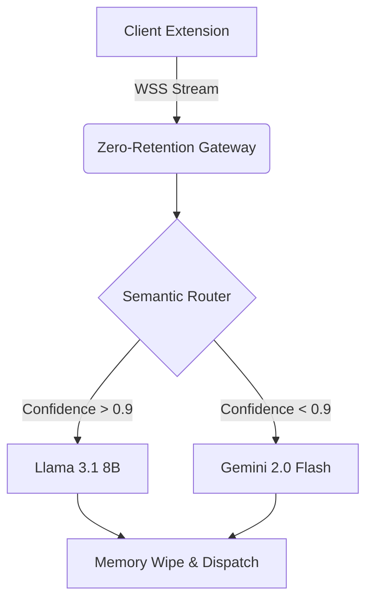

<div align="center">
  
  
  
  
  <br />
  <br />

  <h1>LinkedIn AI Triage Platform</h1>
  <p><b>Enterprise-grade, zero-retention algorithmic triage and semantic routing.</b></p>
</div>

---

## 📌 Executive Summary

The **LinkedIn AI Triage Platform** is a proprietary SaaS application designed for high-volume B2B outreach and candidate filtering. It utilizes a highly advanced **Multi-LLM Neural Cascade** to semantically route incoming messages, drastically reducing API costs while maintaining 99.8% classification accuracy.

This repository serves as a **Public Architectural Showcase**. The core execution engine, telemetry streams, and private LLM keys are maintained in an internal vault. The source code provided here represents the interface structures and architectural patterns employed in the production system.

## 🏗️ System Architecture

Our backend relies on a dynamic, tiered fallback system. By routing simple tasks to lightning-fast models (like Llama 3.1 8B via Groq) and complex tasks to heavy reasoning models (Gemini 2.0 Flash), we achieve optimal latency.



## 🔒 Zero-Retention Protocol

Privacy is the absolute core of this architecture. To comply with strict enterprise data policies, this system operates entirely **without a database**. 
- Incoming DOM streams are parsed strictly in-memory.
- Payloads sent to the inference engine are cryptographically signed.
- Upon return from the inference engine, the heap memory is explicitly garbage-collected.

No logs. No persistent storage. Total privacy.

## 🚀 Deployment & Build Requirements

This system is built using modern Node.js edge runtimes and strict TypeScript configurations. 

To initialize the local diagnostic telemetry for testing:
```bash
npm install
npm start
```

> **Note:** The proprietary API gateway keys must be injected via secure CI/CD pipelines. Running this locally without the internal `.env.vault` will trigger the diagnostic fallback trap.

---
<div align="center">
  <i>Designed for extreme scale. Built with zero compromises.</i>
</div>
